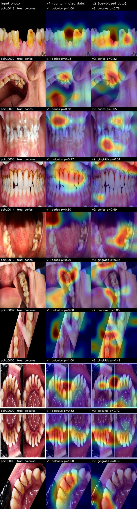

# Six Thousand Images, 199 Photographs

*Draft section for the OralTwin manuscript — classifier findings. Prepared
2026-09-11 from the project record (`models/logs/experiments.md`). Every number
below is reproducible from the scripts named in brackets.*

## Summary

A MobileNetV2 classifier for three oral conditions (caries, dental calculus and
gingivitis) reached 89.96% accuracy on its held-out split of 697 images. Grad-CAM
showed it attending to lips, image corners and background in about seven of ten
inspected cases. An audit of the training corpus traced this to provenance: the
6,246 images in the three source folders derive from 199 distinct photographs,
and one class mixed drawn illustrations and exposure-damaged augmentations with
clinical photographs. Retrained on a de-duplicated 345-image subset with
identical hyperparameters, the classifier reached 63.5% accuracy (95% CI
49.9–75.2%) and kept its prediction under small re-framing for 78.8% of test
photographs. On ten matched cases its attention fell on tooth or gum tissue no
more often than the original model's (6/10 each). The corpus cannot support a
trustworthy classifier; the binding constraint is the data, not the
architecture.

## 1. Shortcut learning in the first classifier

The first model (v1) was trained on 3,255 images and scored 0.8996 on 697 test
images, above the project's 85% gate. Two observations contradicted that
number. Grad-CAM [1] on ten test cases placed the model's attention on tooth or
gum tissue in roughly three; the rest concentrated on the lips, the image
corners or, in one case, the empty background of a cartoon illustration. And a
simulated re-capture of one test photograph (the same photograph under a new
viewpoint and lighting) moved its caries probability from 0.99 to 0.00, which
is not how a model reading tissue behaves.

Both are signatures of shortcut learning [2]: a decision rule that fits the
benchmark through a correlate of the label rather than its cause. Chest-radiograph
COVID-19 detectors have failed the same way, keying on hospital-specific
markers instead of lung findings [3].

## 2. Auditing the corpus

The raw folders stay read-only; every exclusion happens when the training set
is assembled (`src/utils/detect_synthetic.py`, `src/utils/prepare_classification.py`).

**Drawn and damaged images.** A classical detector, with no training, scores
each image on block entropy, the sensor-noise floor (Immerkær's estimator [4]),
the share of flat unclipped pixels, and palette size. Its first version ranked
blown-out photographs highest, because clipping flattens regions and erases the
noise floor exactly as a drawn fill does; clipped pixels are now excluded from
every texture cue, and clipped images carry their own label. Visual review
showed the detector's top ranks are dominated by photographs smeared by
aggressive upsampling rather than by illustrations, so it is best read as a
texture-quality filter. Across the three folders it flagged 297 images as drawn
or texture-free at the approved threshold (0.70) and 966 as clipped.

**The augmented caries folder.** It held about 85% of the caries class as
augmented copies of a few base photographs, and 266 of the 297 drawn flags. It
was dropped whole (2,382 images); caries falls back to its 219 original
clinical photographs.

**Augmentation families.** Each image receives eight perceptual hashes, one per
flip and 90° rotation. Images within Hamming distance 14 join one family: a base
photograph with its flips, crops and exposure variants. At most three images
per family are kept, each class is capped at twice the smallest, and a family
never spans two splits.

**Table 1. From raw folders to training set.**

| Stage | Images | Removed |
|---|---:|---:|
| Raw images, three source folders | 6,246 | |
| Augmented caries folder dropped | 3,864 | 2,382 |
| Clipped (935) and drawn (31) images dropped | 2,898 | 966 |
| Exact duplicates removed (MD5) | 1,683 | 1,215 |
| ≤3 per photograph kept, classes ≤2× smallest | 345 | 1,338 |

The 1,683 unique images group into **199 base photographs**. The final 345 are
caries 122, calculus 85 and gingivitis 138, split 241 / 52 / 52.

## 3. Retraining on the clean subset

v2 was trained with v1's configuration unchanged: two-stage transfer learning
from ImageNet weights, class-weighted loss, early stopping on validation loss.
Table 2 evaluates both models on the same clean test split with the same random
re-framings (rotation ±8°, scale 0.92–1.08, shift ±3%)
(`scripts/compare_models.py`).

**Table 2. Both models on the clean test split (n = 52), Wilson 95% intervals.**

| Metric | v1 (contaminated data) | v2 (de-biased data) |
|---|---|---|
| Accuracy | 0.885 (46/52) [0.770, 0.946] | 0.635 (33/52) [0.499, 0.752] |
| Warp stability | 1.000 (52/52) [0.931, 1.000] | 0.788 (41/52) [0.660, 0.878] |
| F1 caries / calculus / gingivitis | 0.839 / 0.963 / 0.870 | 0.750 / 0.621 / 0.514 |
| Grad-CAM, ten matched cases | 6 pass · 2 marginal · 2 fail | 6 pass · 1 marginal · 3 fail |

v1's column is not a fair benchmark. The clean test photographs belong to the
same 199 families v1 trained on, so most are near-duplicates of images it
memorised; its 88.5% accuracy and perfect warp stability are what memorisation
looks like. v1's reported 89.96% was measured on the original, contaminated
split. v2's figures are the only uncontaminated estimates, and at n = 52 their
intervals span roughly 25 points.

## 4. Where each model looks

Grad-CAM was computed for both models on the same ten photographs, drawn from
longitudinal pairs built on the clean test split, each explained for the class
that model predicted (`scripts/make_paper_figures.py`; Figure 1).

**Table 3. Attention on ten matched photographs.**

| Case | True class | v1 | v2 |
|---|---|---|---|
| pair_0012 | calculus | calculus 1.00 — pass | calculus 0.78 — pass |
| pair_0030 | caries | caries 0.98 — marginal | caries 0.82 — marginal |
| pair_0070 | caries | caries 0.58 — marginal (upper gingiva) | caries 0.55 — fail (lower lip) |
| pair_0008 | calculus | calculus 0.97 — pass | gingivitis 0.51 — pass, wrong class |
| pair_0014 | caries | caries 0.80 — fail (upper lip, corner) | caries 0.69 — fail (tongue) |
| pair_0019 | caries | caries 0.79 — pass (carious molars) | gingivitis 0.36 — fail (lip, cheek) |
| pair_0002 | calculus | calculus 0.80 — fail (black rotation border) | calculus 0.85 — pass |
| pair_0006 | calculus | calculus 1.00 — pass | gingivitis 0.49 — pass, wrong class |
| pair_0009 | calculus | calculus 0.82 — pass | calculus 0.72 — pass |
| pair_0000 | calculus | calculus 1.00 — pass | gingivitis 0.39 — pass, wrong class |

Both models place attention on tooth or gum tissue in six of ten cases. On
matched photographs the de-biased model is not measurably better: it is better
on calculus (6/6 against 5/6, although it labels three of those six as
gingivitis) and worse on caries (0/4 against 1/4). The ten cases contain no true
gingivitis photographs, so neither model's attention on gingivitis was assessed.

> **Correction to the 10 September report.** That report counted cases by
> predicted class (calculus 3/3, gingivitis 3/4, caries 0/3); by true class it is
> calculus 6/6 and caries 0/4. It also presented 3/10 → 6/10 as an effect of
> de-biasing, but the two counts came from different photographs; on matched
> photographs both models score 6/10.

*Figure 1. Ten matched photographs: input, v1 Grad-CAM, v2 Grad-CAM, each
explained for that model's predicted class (label and probability above each
panel).*

## 5. Limitations

- **Small samples.** Test accuracy rests on 52 photographs and attention on 10;
  the 6/10 Grad-CAM count has a 95% interval of 31–83%.
- **Unblinded, non-clinical attention review.** The Grad-CAM verdicts were made by
  the AI assistant that built the pipeline, with each model's prediction visible,
  not by a dental clinician and not blinded. They must be re-scored by a
  clinician before publication.
- **Unstratified case selection.** The ten cases were chosen to exercise the
  change-detection pipeline (changed, unchanged, out-of-frame, low-confidence),
  not to balance classes.
- **Asymmetric folder exclusion.** Only caries had a separate augmented folder,
  so only caries lost one wholesale; calculus and gingivitis duplicates were
  handled by family collapsing alone. All surviving caries photographs therefore
  come from one source folder, which could carry a provenance signature of its
  own.
- **Split by photograph, not patient.** The source has no patient identifiers, so
  one patient photographed twice could span two splits.
- **Environment.** v1 was trained on Colab (TensorFlow 2.20) and converted; v2 on
  CPU with TensorFlow 2.15. Hyperparameters were identical.

## 6. Conclusion and next steps

The data, not the model, is the binding constraint: 199 photographs across three
classes is a pilot, not a training set. The classifier is parked. It will not be
retrained on this corpus and its predictions should not be presented as
findings. The alignment, change-detection and explainability modules do not
depend on it and continue.

When the Piyarathne et al. dataset [5] (about 3,000 smartphone photographs from
714 patients, with patient-level metadata) clears access review:

1. Add it under `data/raw/` and restore the healthy class in `configs/config.yaml`.
2. Re-run the drawn-image detector and review its contact sheets before any
   threshold is set.
3. Rebuild the splits with family collapsing plus patient-level grouping from
   `Patientwise_data.csv`, so no patient spans two splits.
4. Retrain with this configuration and apply the gate: Grad-CAM on tooth or gum
   tissue in at least 8 of a class-stratified, clinician-scored sample of 10, and
   warp stability of at least 0.90.

## References

1. Selvaraju RR, Cogswell M, Das A, Vedantam R, Parikh D, Batra D. Grad-CAM: visual
   explanations from deep networks via gradient-based localization. *Proc. IEEE
   ICCV* 2017:618–626.
2. Geirhos R, Jacobsen J-H, Michaelis C, et al. Shortcut learning in deep neural
   networks. *Nat Mach Intell* 2020;2:665–673.
3. DeGrave AJ, Janizek JD, Lee S-I. AI for radiographic COVID-19 detection selects
   shortcuts over signal. *Nat Mach Intell* 2021;3:610–619.
4. Immerkær J. Fast noise variance estimation. *Comput Vis Image Underst*
   1996;64(2):300–302.
5. Piyarathne et al. A comprehensive dataset of annotated oral cavity images for
   diagnosis of oral cancer and oral potentially malignant disorders. *Oral Oncol*
   2024;156:106946.

Source images: Kaggle "Oral Diseases" dataset (salmansajid05).

*OralTwin is a screening aid, not a diagnostic tool.*
